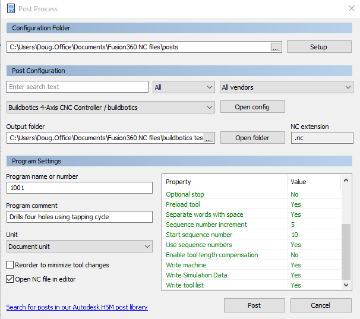

# Fusion360-post-processor
Post processor for fusion 360

Just select 'builbotics.cps' as you post processor from within Fusion 360.

A few new feature were added to the property table in the Fusion 360 post processor dialog.

