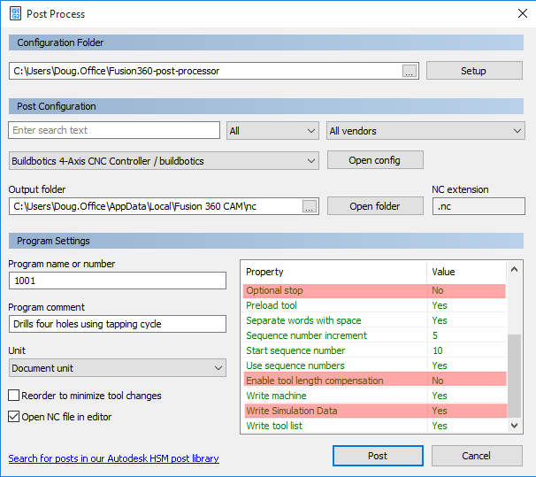
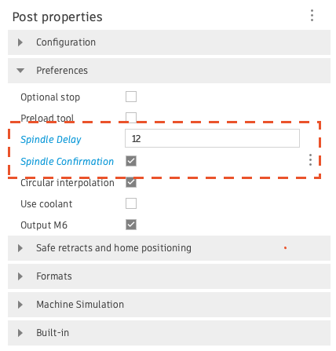

# buildbotics-fusion360-post
Post processor for fusion 360

Just select 'builbotics.cps' as your post processor from within Fusion 360.

A few new feature were added to the property table in the Fusion 360 post processor dialog.

The "Optional Stop" option was added because the Buildbotics Controller currently ignores
the 'M1' command. This was made optional because 'M1' will be supported in a future release.

The default value for "Enable tool length compensation" was set to "No" because the Buildbotics
Controller does not current support this capability. It is planned for a future release.

"Write Simulation Data" was added because this post processor will automatically generate
simulation commands that are compatible with the CutViewer CNC simulator. Setting this to "Yes"
puts this simulation in the comments in the g-code file.

"Set Z-axis retract height" feature was added to avoid confusion about retract height.

"Disable coolant control" feature was added so users that want to use the Load1 or Load2 outputs for something other than coolant control, or to just manually control coolant can prevent F360 from generating coolant control commands in the GCode. The default value for this field is "No", meaning that coolant control is not disabled. Set this field to "Yes" to turn off coolant control commands in F360.

The following two spindle control properties were added by Vincet Schmidt. Thanks Vincent!

> "Spindle Delay" was added to insert a delay, specified in seconds, after the spindle start command has been issued (M3). This is useful if you experience issues with your spindle not reaching the desired speed quickly enough before engaging with the material.

> "Spindle Confirmation" feature was added to insert a pause with a prompt (M0) after the spindle start command (M3). This lets users manually confirm if the spindle is running correctly before continuing with their program.

Modified the writeRetact program to simply make a rapid move (G0) to the retract height specified by the "Set Z-Axis retract height value".

## Probing support added on 10/10/19
The following types of probing are now supported:
  * probing-xy-outer-corner
  * probing-x
  * probing-y
  * probing-z
